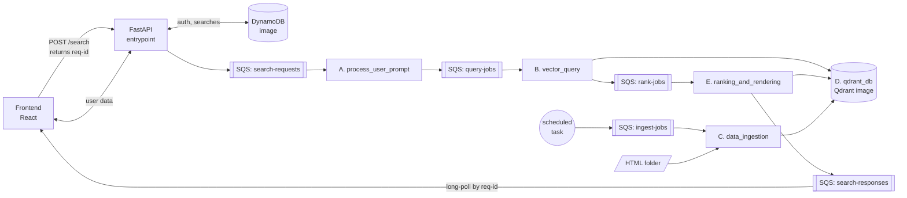
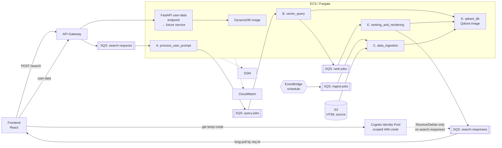

Context: 
    We are building an application for a real estate company that uses semantic search to find properties based on user input.
    This document describes the architecture of the applications backend.
    At the moment, we want to use the following technologies:
    - Python
      - Docker
      - Docker compose
      - FastAPI
      - Pydantic
      - Qdrant
      - Fargate
      - Api Gateway
      - ECS
      - S3
      - SQS
      - DynamoDB
      - SSM
      - Cloudwatch
      - Pulumi

Rules:
    We want to use a microservices architecture. Each service will be a docker container deployed on Fargate. 
    For local development, lets use docker compose and fastapi. 
    On cloud ApiGateway replaces fastapi.
    Use docker images for Dynamo and Qdrant.
    Use DynamoDb for user data (auth, searches, etc).
    Services should be stateless and communicate with each other SQS messages (locally too if possible, otherwise we need a script to invoke them sequentially).

Services description: 
   A) process_user_prompt: takes in a natural language sentence and returns a json with the identified fields using LLM model
   B) vector_query: Takes in the json from process_user_prompt service, parses it and: 
        1) Creates filters from the json
        2) Generate embeddings for semantic search
        3) Retrieves documents using similarity search and filters from qdrant_db service
        4) Returns documents ids list and filters list
   C) data_ingestion: Reads html files from a folder, parses them into properties, creates embeddings and stores them in qdrant db
   D) qdrant_db: Used by the vector_query and ranking_and_rendering services to retrieve documents from the db and data_ingestion to insert new documents
   E) ranking_and_rendering: 
         Takes in the documents ids list from vector_query service, 
         Gets full documents data and rank the results using db score based on filters from vector_query service
         returns the ranked results as json
   F) frontend: React app that uses the API (fastapi local, APiGateway on cloud) to do natural language search and render results

Current Needs: 
    For now we just the services to do nothing and just take in the inputs and return simulated outputs.
    We just care about the architecture and service communication / integration.

---

## Architecture Decisions (Addenda)

1. **Async request/response via SQS**
    - FE `POST /search` returns a `request-id`; FE then long-polls a response queue for a message tagged with that id.
    - No synchronous HTTP response path for search.

2. **Self-hosted data stores (academic project)**
    - Qdrant and DynamoDB run as stock Docker images on Fargate tasks (single task each), with EFS/EBS for persistence.
    - No managed services.

3. **User data access**
    - A FastAPI endpoint in the entrypoint app handles user data (auth, searches) against DynamoDB for now.
    - To be factored out into its own microservice later.

4. **Ingestion trigger**
    - Triggered on a schedule — EventBridge (cloud) / cron or a compose profile (local).
    - Scheduled task publishes to `ingest-jobs` SQS; `data_ingestion` consumes it.
    - HTML source: S3 in cloud, local folder in dev.

5. **Frontend → SQS auth (cloud)**
    - Browser obtains short-lived, scoped IAM credentials via Cognito (Identity Pool).
    - Credentials permit only `sqs:ReceiveMessage` / `sqs:DeleteMessage` on the `search-responses` queue.
    - FE long-polls that queue, filtering by its `request-id`.
    - Local dev: ElasticMQ (or LocalStack SQS) with no auth.

## Queues

- `search-requests`  — API Gateway / FastAPI → `process_user_prompt`
- `query-jobs`       — `process_user_prompt` → `vector_query`
- `rank-jobs`        — `vector_query` → `ranking_and_rendering`
- `search-responses` — `ranking_and_rendering` → Frontend
- `ingest-jobs`      — Scheduled task → `data_ingestion`

## Diagrams

### Local (Docker Compose)

### Cloud (AWS + Pulumi)

