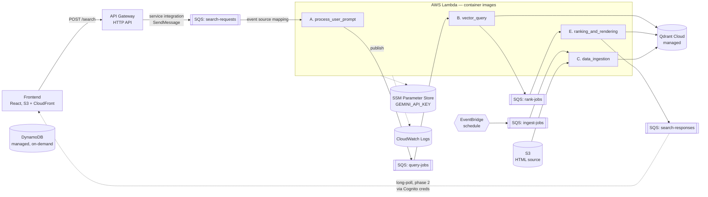

# Cloud architecture — revised

This document supersedes the cloud sections of [`Architecture.md`](Architecture.md)
for the actual deployment. The local-dev topology (docker-compose +
ElasticMQ + Qdrant container + DynamoDB Local) is unchanged — see
[`DESARROLLO.md`](DESARROLLO.md). Service responsibilities (A–E) are also
unchanged from the original doc; only the runtime, networking, and
data-store choices were revised.

## What changed and why

The original plan was "everything as a Fargate task on a custom VPC,
self-hosted Qdrant + DynamoDB, ApiGateway only at the edge." For the
academic-project scope and a fast time-to-deploy, we revised:

| Concern              | Original                                | Revised                                              |
|----------------------|-----------------------------------------|------------------------------------------------------|
| Service runtime      | ECS Fargate (one task per service)      | **AWS Lambda (container images)** triggered by SQS  |
| Networking           | Custom VPC + public/private + NAT       | **No VPC** — Lambdas + managed services only         |
| User data store      | DynamoDB image on Fargate + EFS         | **Real AWS DynamoDB** (free tier)                    |
| Vector store         | Qdrant image on Fargate + EFS           | **Qdrant Cloud** (free tier, ~1 GB)                  |
| HTTP ingress         | API Gateway → service container         | **API Gateway HTTP API → SQS service integration**   |
| FE → response queue  | Cognito Identity Pool + scoped IAM      | Same intent; deferred (phase 2)                      |
| FE hosting           | S3 + CloudFront                         | Same                                                 |

The trade-off is honest: we lose the "container-as-the-deploy-unit"
purity in exchange for *zero* VPC/NAT/ECS surface area. The same
Docker image runs on both Lambda and Fargate — only the entrypoint
changes — so a future migration back to Fargate is a per-service
change, not a re-architecture.

## Topology



The five SQS queues, message schemas, and per-service responsibilities
match `Architecture.md`. The runtime substrate is what changed.

## AWS services used

| Service                | Use                                                        |
|------------------------|------------------------------------------------------------|
| Lambda (container)     | Each microservice runs as a Lambda fronted by an SQS event |
| API Gateway HTTP API   | `POST /search` → SQS `search-requests` (no Lambda hop)     |
| SQS                    | 5 queues, identical names/contracts to local dev           |
| DynamoDB               | User data (real DDB, on-demand billing)                    |
| S3                     | (a) HTML source for ingestion, (b) FE static hosting       |
| CloudFront             | CDN + HTTPS in front of the FE bucket                      |
| SSM Parameter Store    | `GEMINI_API_KEY`, Qdrant URL/API key, etc.                 |
| CloudWatch Logs        | Lambda logs (auto), one log group per function             |
| EventBridge            | Scheduled trigger for `data_ingestion`                     |
| ECR                    | Container image registry — one repo per Lambda service     |
| Qdrant Cloud           | Managed vector store (external SaaS, accessed via HTTPS)   |

No VPC, no NAT gateway, no ECS, no ALB, no EFS.

## Per-service Lambda packaging

Each worker service gets one new file and one new Dockerfile:

```
services/<svc>/
├── src/<svc>/
│   ├── handler.py            # unchanged — pure logic, used by both runtimes
│   ├── worker.py             # unchanged — local dev SQS long-poll loop
│   └── lambda_handler.py     # NEW — Lambda entrypoint
├── Dockerfile                # unchanged — local docker-compose
└── Dockerfile.lambda         # NEW — image for AWS Lambda
```

`lambda_handler.py` is a thin wrapper that iterates the SQS batch event
and calls the same `handle()` function used locally:

```python
def handler(event, context):
    for record in event["Records"]:
        msg = InputSchema.model_validate_json(record["body"])
        out = handle(msg)
        if out is not None:
            publish(settings.queue_<next>, out)
```

`Dockerfile.lambda` uses `public.ecr.aws/lambda/python:3.12` as the
base — that image already includes the AWS Lambda Runtime Interface,
so no per-service runtime client to install.

`api_gateway` does **not** become a Lambda. Its `POST /search` job is
done in cloud by the AWS API Gateway → SQS service integration.

## Service runtime config — local vs. cloud

`shared/settings.py` is loaded by every service. Its defaults are
tuned for local docker-compose (ElasticMQ on `localhost:9324`, dummy
AWS creds, short queue names). On Lambda we override two things via
environment variables and *nothing else* changes in the code:

| Variable                | Local default                | Cloud (Lambda) value                                | Effect                                                                                       |
|-------------------------|------------------------------|-----------------------------------------------------|----------------------------------------------------------------------------------------------|
| `SQS_ENDPOINT_URL`      | `http://localhost:9324`      | **empty string `""`**                               | When empty, `shared/sqs.py` skips passing `endpoint_url` + creds to boto3, so it uses the regional SQS endpoint and the Lambda's IAM-role credentials. |
| `AWS_ACCESS_KEY_ID`     | `x`                          | *unset*                                             | Same — boto3 picks up role creds when not explicitly passed.                                 |
| `AWS_SECRET_ACCESS_KEY` | `x`                          | *unset*                                             | Same.                                                                                        |
| `AWS_REGION`            | `elasticmq`                  | (set automatically by Lambda runtime)               | boto3 talks to the right regional endpoint.                                                  |
| `QUEUE_<NAME>`          | short name (`query-jobs`, …) | full prefixed cloud name (`inmo-dev-queue-…`)       | `shared/sqs._queue_url()` calls `GetQueueUrl(QueueName=…)` to resolve to the full SQS URL.   |
| `GEMINI_API_KEY`        | from repo-root `.env`        | (read from SSM by service code, not as an env var)  | Lambda role allows `ssm:GetParameter` on the prefixed parameter.                             |

The Pulumi service stacks (`process-user-prompt/__main__.py` is the
template) set every variable in this table. The IAM policy attached
to the Lambda role grants `sqs:GetQueueUrl` (account-scoped),
`sqs:Receive/Delete/GetQueueAttributes` on the input queue,
`sqs:SendMessage` on the output queue, and `ssm:GetParameter` on the
Gemini key.

This pattern is what makes the same `handle()` function work in both
runtimes without conditional `if local:` branches — only `worker.py`
(local) and `lambda_handler.py` (cloud) differ.

## Pulumi microstack layout

Eight deployable stacks under `infra/pulumi/`. Naming matches the
thing each stack deploys; numeric prefixes intentionally avoided.

```
infra/pulumi/
├── _bootstrap/              # S3 state bucket + DDB lock table (one-time, local backend)
├── _shared/                 # python helpers — not a stack
│
├── platform/                # everything shared, NO VPC:
│                            #   - 5 SQS queues
│                            #   - ECR repos (one per Lambda service)
│                            #   - SSM Parameter Store entries
│                            #   - CloudWatch log groups
│                            #   - DynamoDB tables
│                            #   - S3 source bucket (HTML for ingestion)
│
├── api-gateway/             # API Gateway HTTP API + SQS integration
├── frontend/                # S3 + CloudFront
│
├── process-user-prompt/     # Lambda (container) + SQS event source mapping
├── vector-query/            # Lambda + Qdrant Cloud client config
├── ranking-and-rendering/   # Lambda + Qdrant Cloud client config
└── data-ingestion/          # Lambda + EventBridge schedule + S3 read perms
```

Stack-reference graph:

```
_bootstrap
    ↓
platform ────────────────────────────────────┐
    ↓                                        │
    ├── api-gateway                          │
    ├── frontend ←── api-gateway.endpoint    │
    ├── process-user-prompt ─────────────────┤
    ├── vector-query ────────────────────────┤
    ├── ranking-and-rendering ───────────────┤
    └── data-ingestion ──────────────────────┘
```

`platform` is the only foundation stack — service stacks only consume
its outputs, never each other's. Same-tier stacks are independent and
can deploy in any order.

## Day-one slice

To validate the cloud path without waiting for the full chain to be
correct:

1. `_bootstrap`
2. `platform` (slim — only `search-requests` queue, ECR for
   `process_user_prompt`, SSM `GEMINI_API_KEY`, log group)
3. `api-gateway` — exposes `POST /search`
4. `process-user-prompt` — Lambda triggered by `search-requests`
5. `frontend` — points at the API Gateway endpoint via
   `VITE_API_URL` baked at build time

That gives FE → API Gateway → SQS → Lambda end-to-end on real AWS,
with Gemini called from a real Lambda, even though the rest of the
service chain has open integration bugs.

## What's deferred

- **Cognito Identity Pool for FE → SQS direct poll.** Until then,
  `search-responses` is read by a `GET /results/{request_id}` endpoint
  on the API Gateway (Lambda-backed long-poll), or simply not wired —
  matches the current local FE which only shows "siendo procesada".
- **Qdrant migration off the Cloud SaaS** if the free tier becomes a
  bottleneck. The replacement is straightforward: stand up a single
  EC2 / ECS Fargate task, swap the URL in SSM, no other code changes.
- **Per-service Fargate migration** if Lambda cold starts or 15-min
  timeouts hurt the demo. The Docker image and `handle()` are reused
  unchanged — only `lambda_handler.py` is replaced by `worker.py` (or
  both kept, selected via the entrypoint).
- **Tracer cloud equivalent.** The local `tracer` service tails docker
  logs; in cloud, the same `GET /trace/{request_id}` shape can wrap a
  CloudWatch Logs Insights query. Phase 2.

## Cost shape (rough, dev environment)

All within free tier or pennies per month at this traffic:

- Lambda: 1M free invocations/mo; this project will do dozens.
- API Gateway HTTP API: $1 per million requests, free tier 1M/mo.
- SQS: 1M free requests/mo.
- DynamoDB on-demand: free tier covers 25 RCU/WCU.
- S3 + CloudFront: pennies for static FE + ~50 HTML files.
- ECR: $0.10/GB/mo storage; service images are <500 MB total.
- Qdrant Cloud: free tier (~1 GB).
- SSM: free for standard parameters.
- CloudWatch Logs: 5 GB free/mo.
- **EBS / NAT / ALB / EFS / Fargate: $0** — none of these are used.
